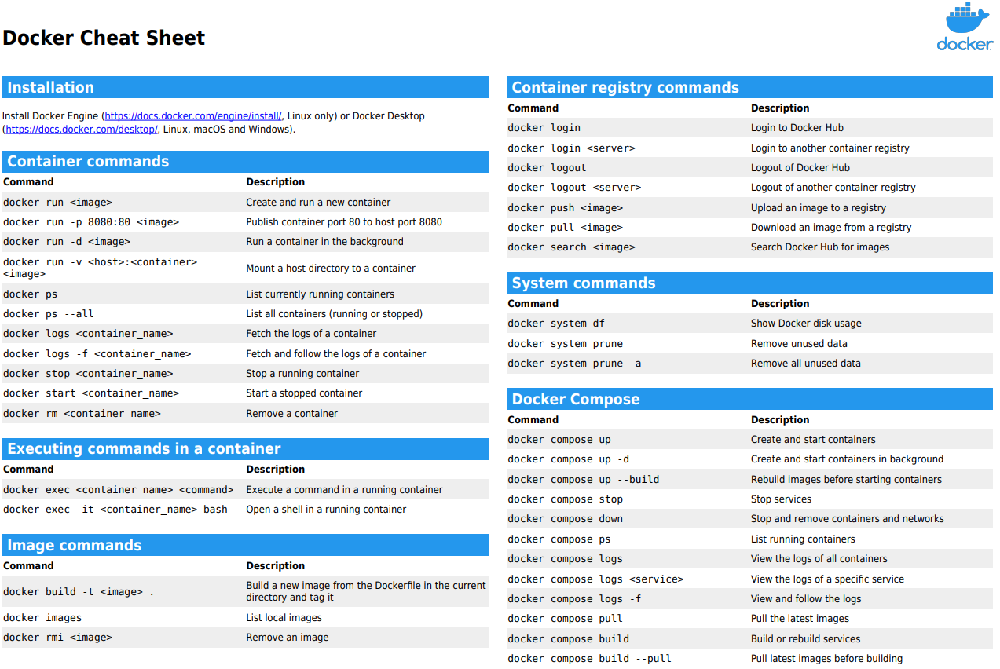
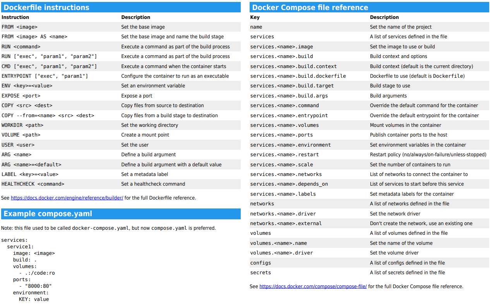
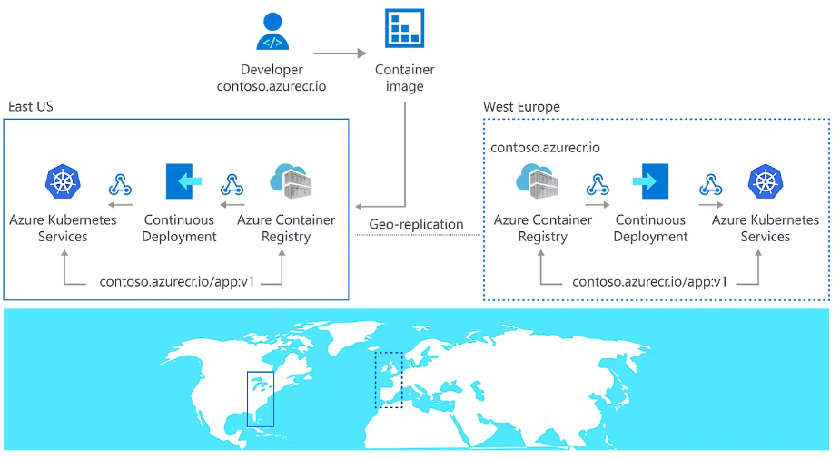

# Docker Notes 🐳

1. [Traditional Approach: Virtual Machines (Old Solution)](#traditional-approach-virtual-machines-old-solution)
2. [Docker Solution: Containers (New Solution)](#docker-solution-containers-new-solution)
3. [Key Docker Concepts](#key-docker-concepts)
4. [Dockerfile Breakdown](#dockerfile-breakdown)
5. [Common Docker Commands](#common-docker-commands)
6. [Docker Compose](#docker-compose)
7. [Docker Image Optimisation](#docker-image-optimisation)
8. [Docker Networking](#docker-networking)
9. [Docker Registry](#docker-registry)
10. [Docker Workflow](#docker-workflow)
11. [AWS ECR](#aws-ecr)
12. [Azure ACR](#azure-acr)
13. [Google AR](#google-ar)
14. [Scaling Containers](#scaling-containers)

## Traditional Approach: Virtual Machines (Old Solution)

- **Baseline**: Hardware (CPU, RAM, Disk) + OS
  - **Virtual Machine (VM)**:
    - Each VM runs its own OS and dependencies, leading to heavy resource consumption (CPU + RAM + Disk).
    - VMs often introduce performance bottlenecks due to the overhead of hypervisors and individual OS for each VM.

### Application Stack on VMs

- **Web Server**: Nginx
- **Database**: MongoDB
- **Messaging Queue**: Redis
- **Orchestration**: Ansible

**Problem**: Compatibility issues across hardware, OS, libraries, and dependencies, leading to the notorious "matrix nightmare."

- Common scenario: "It works on my machine!" but fails in production.

## Docker Solution: Containers (New Solution)

- **Baseline**: Hardware (CPU, RAM, Disk) + OS
  - **Docker Engine**:
    - Instead of virtualising the hardware like VMs, Docker virtualises the host OS, allowing containers to share the same OS kernel while running in isolated environments.
    - This makes containers faster, more lightweight, and efficient compared to VMs.

## Key Docker Concepts

1. **Dockerfile**: A blueprint for building the Docker image.
2. **Docker Image**: A template for running the docker container; includes everything needed to run an application (e.g., OS, dependencies, app code).
3. **Container**: A running instance of the application.

## Dockerfile Breakdown

A **Dockerfile** describes the steps to build a container. Here's a breakdown of common instructions:

1. **FROM**: Specifies the base image (e.g., `FROM python:3.9-alpine`).
2. **WORKDIR**: Sets the working directory inside the container.
3. **COPY**: Copies files from the host machine into the container (e.g., `COPY requirements.txt .`).
4. **RUN**: Executes commands inside the container (e.g., installing dependencies).
5. **EXPOSE**: Exposes a port inside the container (note: this port is not automatically accessible externally).
6. **ENV**: Sets environment variables.
7. **CMD**: Defines the default command to run when the container starts (e.g., `CMD ["python", "app.py"]`).

## Common Docker Commands

- **Build an image**:
  ```bash
  docker build -t <image_name> <path_to_Dockerfile>
  ```
- **Run a container with port mapping**:
  ```bash
  docker run -p 8080:5000 <container_name>
  ```
  HOST:CONTAINER - Maps port 5000 inside the container to port 8080 on the host.
- **Volume mapping** (for persistent data storage):
  ```bash
  docker run -v /opt/datadir:/var/lib/mysql mysql
  ```
- **Push an image to Docker Hub**:

  ```bash
  docker push <image_name>
  ```

- **Pull an image from Docker Hub**:
  ```bash
  docker pull <image_name>
  ```



Source: Nic Wortel

## Docker Compose

**Docker Compose** allows defining and running multi-container applications using a YAML file. It simplifies orchestrating applications that consist of multiple services (e.g., web server, database, caching).

**Key Benefits**:

- Start all services with a single command: `docker-compose up`.
- Define networks, volumes, and dependencies between services.
- Scale services easily with `docker-compose up --scale <service>=N`.

**Example**:

```yaml
version: "3.8"

services:
  web:
    image: nginx:alpine
    ports:
      - "80:80"
    volumes:
      - ./nginx.conf:/etc/nginx/nginx.conf
    depends_on:
      - app

  app:
    build: ./app
    volumes:
      - ./app:/app
    ports:
      - "5000:5000"
    environment:
      - DATABASE_URL=mysql://root:password@db/mydb
    depends_on:
      - db

  db:
    image: mysql:5.7
    environment:
      MYSQL_ROOT_PASSWORD: password
      MYSQL_DATABASE: mydb
    volumes:
      - db_data:/var/lib/mysql

volumes:
  db_data:
```

This docker-compose.yml file defines a multi-container application stack consisting of three services: a database (MySQL), an application (backend), and a web server (Nginx). Each service is configured to run in its own container, and they are linked to ensure proper communication.

The `depends_on` is used to define the order in which services are started. However, it does not wait for a service to be "ready" (i.e., fully operational), but only ensures that the dependent service has been started:

- `app` depends on `db`
- `web` depends on `app`

## Docker Image Optimisation

1. **Use a Smaller Base Image**:

   - Instead of using full OS images (e.g., `ubuntu`), **Alpine** (`alpine:latest`) is a lightweight alternative.
   - For Python applications: `python:3.9-alpine`.

2. **Multi-Stage Builds**:

   - Separate build and runtime stages to create smaller final images.
   - Example:

     ```Dockerfile
     # Stage 1: Build
     FROM python:3.9-slim AS builder
     WORKDIR /app
     COPY requirements.txt .
     RUN pip install --no-cache-dir -r requirements.txt
     COPY . .

     # Stage 2: Runtime
     FROM python:3.9-alpine
     WORKDIR /app
     COPY --from=builder /app /app
     EXPOSE 8080
     CMD ["python", "app.py"]
     ```

3. **Minimise Layers**:

   - Combine multiple `RUN` instructions into a single line to reduce layers and image size:
     ```Dockerfile
     RUN apt-get update && apt-get install -y package && rm -rf /var/lib/apt/lists/*
     ```

4. **Use `.dockerignore`**:

   - Avoid copying unnecessary files into the image (similar to `.gitignore`).

5. **Remove Unused Dependencies**:

   - Uninstall build dependencies after they are no longer needed:
     ```Dockerfile
     RUN apt-get remove --purge -y build-essential
     ```

6. **Use Slim Versions of Images**:
   - Use official "slim" versions of images when possible (e.g., `python:3.9-slim`).

## Docker Networking

**Docker provides several networking modes depending on the use case**:

1. **Bridge Network** (default for standalone containers):

   - Containers on the same bridge network can communicate via IP or container names.
   - Example:
     ```bash
     docker network create my-bridge-network
     docker run -d --name container1 --network my-bridge-network nginx
     ```

2. **Host Network**:

   - The container shares the host's network stack directly.
   - Example:
     ```bash
     docker run --network host nginx
     ```

3. **None Network**:

   - The container has no network interface.
   - Example:
     ```bash
     docker run --network none nginx
     ```

4. **Overlay Network** (for multi-host setups, e.g., Docker Swarm):

   - Example:
     ```bash
     docker network create --driver overlay my-overlay-network
     ```

5. **Macvlan Network** (legacy apps needing unique MAC addresses):
   - Example:
     ```bash
     docker network create -d macvlan --subnet=192.168.1.0/24 --gateway=192.168.1.1 -o parent=eth0 my-macvlan-network
     ```

### Summary

- **Bridge Network**: Default, container-to-container communication on the same host.
- **Host Network**: Directly shares the host's network (for performance reasons).
- **None Network**: No networking, fully isolated.
- **Overlay Network**: Enables multi-host communication (for Docker Swarm or Kubernetes).
- **Macvlan Network**: Assigns containers their own MAC addresses.

## Docker Registry

A **Docker Registry** is a storage and distribution hub for Docker images. It allows you to store custom Docker images, making them available for download and use in different environments (local, staging, production).

### Key Concepts

1. **Docker Hub**: The default and public Docker registry provided by Docker. It hosts a vast collection of official and community-contributed images. When you use `docker pull <image_name>`, [Docker Hub](https://hub.docker.com/) is the default source.

2. **Private Registry**: this is useful for enterprise or internal use cases when you don’t want to store images publicly.

3. **Self-hosted Registries**: this lets you store images privately using the `registry` Docker image from Docker Hub.

### Common Commands

**Login to a Docker Registry**:

```
docker login
```

**Push an Image to Docker Hub**:

```
docker tag <image_id> <dockerhub_username>/<image_name>:<tag>
```

```
docker push <dockerhub_username>/<image_name>:<tag>
```

**Pull an Image from Docker Hub**:

```
docker pull <image_name>:<tag>
```

**Run a Private Registry** (locally or on a server):

```
docker run -d -p 5000:5000 --name registry registry:2
```

**Push an Image to a Private Registry**:

```
docker tag <image_id> localhost:5000/<image_name>
```

```
docker push localhost:5000/<image_name>
```

**Pull an Image from a Private Registry**:

```
docker pull localhost:5000/<image_name>
```

## Docker Workflow

1. **Push Image**: Upload your container image to a registry (e.g., Docker Hub).
2. **Pull Image**: Download the container image from the registry.
3. **Run Image**: Start a container based on the image.

### Comparison of Docker Hub, ECR, ACR, AR

| Feature             | Docker Hub                             | AWS ECR                            | Azure ACR                            | Google Artifact Registry           |
| ------------------- | -------------------------------------- | ---------------------------------- | ------------------------------------ | ---------------------------------- |
| **Registry Type**   | Public & Private                       | Private                            | Private                              | Public & Private                   |
| **Authentication**  | Docker Hub account                     | AWS IAM                            | AAD                                  | Google Cloud IAM                   |
| **Integration**     | Docker CLI, Kubernetes, GitHub Actions | ECS, EKS, CodePipeline             | AKS, Azure DevOps                    | GKE, Cloud Run, Cloud Build        |
| **Geo-replication** | No                                     | No                                 | Yes                                  | Yes                                |
| **Pricing**         | Free for public, paid for private      | Based on storage and data transfer | Based on storage and geo-replication | Based on storage and data transfer |

## AWS ECR


Source: [AWS ECR](https://aws.amazon.com/ecr/)

The Docker image is pushed to Amazon ECR, which securely stores and manages Docker container images. Amazon ECR simplifies the process of storing, securing, and managing container images by offering features like encryption, access control, and lifecycle management. It integrates seamlessly with ECS (Elastic Container Service) and EKS (Elastic Kubernetes Service), as well as on-premises environments, providing a consistent and scalable platform for deploying containerised applications.

## Azure ACR



Source: [Azure ACR](https://azure.microsoft.com/en-us/products/container-registry)

The diagram illustrates how Azure Container Registry (ACR) integrates into a multi-region deployment with AKS and Continuous Deployment (CD) pipelines, using geo-replication for efficient and reliable image distribution.

Key Steps:

- **Developer**: Creates and pushes a container image to ACR.
- **ACR**: Stores the image in East US and replicates it to West Europe using geo-replication, improving availability and reducing latency.
- **Continuous Deployment (CD)**: Pipelines (e.g., Azure DevOps) pull images from ACR and automatically deploy them to various environments.
- **Azure Kubernetes Service**: Deploys the container image to AKS clusters in both East US and West Europe.

Benefits:

- **Global Availability**: Geo-replication ensures images are accessible across multiple regions.
- **High Availability**: Applications are deployed across regions, ensuring redundancy and minimising downtime.
- **Fast Deployments**: Localised ACR replication speeds up image retrieval and deployment times.

## Google AR


Source: [Joey Whelan Tech Tips](https://joeywhelan.blogspot.com/2021/06/google-cloud-devops.html)

A developer pushes code to GitHub, Cloud Build is triggered to create and push a Docker image to Google Artifact Registry. The Docker image is then deployed to Cloud Run, a serverless platform for running containerised applications. The process automates the deployment of new code changes to a production environment using Google Cloud services.

Benefits:

- **Multi-format Support**: Supports not just Docker images but also other artifacts like npm, Maven, and Python packages.
- **Granular Permissions**: Provides fine-grained, repository-level permissions for better control over access to specific artifacts.
- **Regional Repositories**: Allows storing artifacts in specific regions, reducing latency and enabling faster retrieval.
- **Security**: Integrated with Google Cloud IAM for permission management and includes advanced features like vulnerability scanning.
- **Seamless Integration**: Works with Google Kubernetes Engine (GKE), Cloud Run, and Cloud Build for automated deployment and orchestration.

## Scaling Containers:

- Use [**Kubernetes**](https://kubernetes.io/docs/home/) as an orchestration tool to scale and manage multiple containers.
